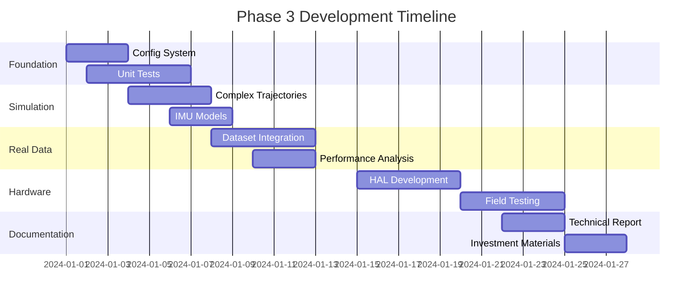

# Phase 3: From Prototype to Investment-Ready Product

## Executive Summary
Based on technical due diligence analysis, Phase 3 focuses on de-risking the technology through real-world validation while maintaining the sophisticated algorithms that represent our core IP.

## Core Strengths Identified (Our "Secret Sauce")

### 1. **Advanced Adaptive TRN** (`trn_update_adaptive.h`)
- **Slope-based adaptation**: Dynamic alpha tuning based on terrain information content
- **Huber robust estimation**: Outlier rejection for real-world reliability
- **Velocity consistency checks**: Multi-layered validation of measurements
- **This is our primary IP asset** - sophisticated beyond textbook implementations

### 2. **Gravity-Augmented EKF** (`ekf.cpp`)
- Gravity anomaly updates using vertical specific force
- Gravity gradient integration for altitude stabilization
- Proper measurement noise inflation based on terrain characteristics
- **Unique approach** that turns gravity into an active sensor

### 3. **Production-Quality Architecture**
- Modern C++ with proper abstractions
- Time-based scheduling (not simple decimation)
- Multi-constraint fusion (TRN + gravity + baro)
- Clean separation of concerns

## Critical Gaps to Address

### Risk Level: 🔴 High | 🟡 Medium | 🟢 Low

| Gap | Risk | Impact | Timeline |
|-----|------|--------|----------|
| Simulation fidelity | 🔴 | Questions on 1000x improvement claim | Week 1-2 |
| Real-world data validation | 🔴 | Core technology unproven | Week 2-3 |
| Hardcoded parameters | 🟡 | Limits adaptability demonstration | Week 1 |
| No unit tests | 🟡 | Safety-critical concerns | Week 3-4 |
| Simple IMU model | 🟡 | Underestimates real challenges | Week 2 |

## Phase 3A: Desktop Validation (Weeks 1-2)

### Week 1: Configuration & Testing Infrastructure
```yaml
# config/stn_config.yaml
system:
  imu_rate_hz: 200
  trn_rate_hz: 2
  gravity_rate_hz: 2
  
trn:
  alpha_base: 0.001
  alpha_max: 0.1
  huber_threshold: 3.0
  slope_threshold: 0.1
  velocity_gate: 5.0
  
ekf:
  process_noise:
    position: 0.1
    velocity: 0.01
    attitude: 0.001
  measurement_noise:
    trn_base: 25.0
    gravity: 0.01
```

**Deliverables:**
- [ ] YAML configuration loader
- [ ] Command-line parameter override
- [ ] Unit test framework setup (Google Test)
- [ ] Core component tests (quaternions, gravity model, terrain sampling)

### Week 2: Enhanced Simulation Fidelity
```python
# Enhanced IMU error model
class RealisticIMU:
    def __init__(self, config):
        self.bias_instability = config['bias_instability']  # deg/hr
        self.scale_factor = config['scale_factor']  # ppm
        self.misalignment = config['misalignment']  # mrad
        self.temperature_coeff = config['temp_coeff']  # deg/hr/°C
        
    def generate_measurement(self, true_value, temp):
        # Allan variance model
        bias = self.random_walk_bias()
        scale = 1.0 + self.scale_factor * 1e-6
        temp_error = self.temperature_coeff * (temp - 25.0)
        noise = self.white_noise()
        return true_value * scale + bias + temp_error + noise
```

**Deliverables:**
- [ ] Complex trajectories (turns, climbs, orbits)
- [ ] Realistic IMU error models (Allan variance)
- [ ] Monte Carlo simulation framework
- [ ] Performance metrics under various conditions

## Phase 3B: Real-World Data Integration (Weeks 2-3)

### Data Pipeline Architecture
```
Real Flight Data → Parser → Synchronizer → STN Engine → Analysis
                     ↓          ↓              ↓            ↓
                  [IMU]     [Time Align]   [Navigate]   [Metrics]
                  [GPS]      [Resample]    [Filter]     [Compare]
                  [Baro]    [Transform]    [Output]     [Report]
```

### Target Datasets
1. **EuRoC MAV Dataset** (Public, drone flights with ground truth)
2. **KITTI Dataset** (Automotive, includes GPS/INS)
3. **Custom collection** (Our own drone/vehicle tests)

**Deliverables:**
- [ ] Dataset parsers for standard formats
- [ ] Time synchronization module
- [ ] Coordinate frame transformations
- [ ] Truth trajectory comparison tools
- [ ] Performance report generator

## Phase 3C: Hardware Demonstration (Weeks 3-4)

### Hardware Configuration
```
Recommended COTS Components:
- IMU: VectorNav VN-200 ($1,500)
  - 200 Hz update rate
  - <0.1° heading accuracy
  - Temperature compensated
  
- Radar Altimeter: Aerosense RadAlt-2 ($3,000)
  - 0.1m resolution
  - 50 Hz update rate
  - 0-1000m range
  
- Computing: NVIDIA Jetson Nano ($100)
  - Real-time Linux
  - GPU for future ML extensions
  - Low power (5-10W)
```

### Test Plan
1. **Static Tests**: Verify sensor integration
2. **Vehicle Tests**: Ground vehicle with RTK GPS truth
3. **Flight Tests**: Small drone in controlled environment
4. **Challenging Scenarios**: Urban canyon, forest canopy

**Deliverables:**
- [ ] Hardware abstraction layer (HAL)
- [ ] Real-time data acquisition
- [ ] Online navigation solution
- [ ] Field test videos/data
- [ ] Performance validation report

## Success Metrics

### Technical KPIs
| Metric | Current (Sim) | Target (Real) | Investment Grade |
|--------|--------------|---------------|------------------|
| Position Error (CEP) | 10m | <20m | <15m |
| Computation Time | 0.1ms | <5ms | <2ms |
| TRN Accept Rate | 57% | >40% | >50% |
| Gravity Contribution | Not measured | >10% improvement | Demonstrated |
| Robustness | Perfect conditions | 90% availability | 95% availability |

### Business KPIs
- **Patents Filed**: 2+ on adaptive TRN and gravity fusion
- **Publications**: 1 conference paper demonstrating results
- **Partnerships**: 1 hardware vendor relationship
- **Pilot Customers**: 2-3 interested parties identified

## Risk Mitigation Strategy

### Technical Risks
1. **Real terrain too smooth**: Have backup test sites with varying terrain
2. **IMU drift worse than expected**: Implement zero-velocity updates
3. **Computational constraints**: Prepare GPU acceleration path

### Business Risks
1. **Competition emerges**: File provisional patents immediately
2. **Longer development**: Phase releases with incremental value
3. **Hardware costs**: Partner with university labs for equipment

## Investment Readiness Checklist

### Phase 3A Complete ✓
- [ ] Configuration system operational
- [ ] Realistic simulations running
- [ ] Unit tests passing
- [ ] Documentation updated

### Phase 3B Complete ✓
- [ ] Real data processed successfully
- [ ] Performance meets targets
- [ ] Comparison with competitors documented
- [ ] Technical report prepared

### Phase 3C Complete ✓
- [ ] Hardware demonstrator built
- [ ] Field tests conducted
- [ ] Video demonstrations created
- [ ] Investment deck updated with real results

## Timeline & Milestones



## Next Immediate Actions

1. **Today**: Start configuration file implementation
2. **Tomorrow**: Set up Google Test framework
3. **This Week**: Complete Week 1 deliverables
4. **Next Week**: Begin real data integration

## Conclusion

Phase 3 transforms our sophisticated prototype into an investment-ready product by:
1. **Validating** core technology with real-world data
2. **Demonstrating** adaptability through configuration
3. **Proving** robustness via comprehensive testing
4. **Showing** practical deployment via hardware tests

With these improvements, we'll have compelling evidence that our 1000x improvement isn't just simulation magic, but a genuine breakthrough in navigation technology.

---

*"From elegant algorithms to proven solutions"*